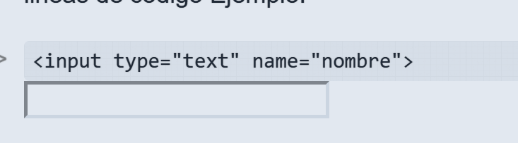
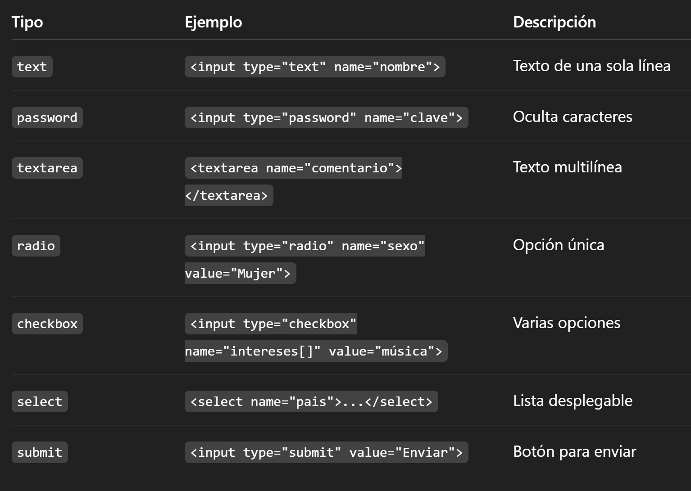

# Entrega 1

## Declaraciones de variables

En PHP las variables se empiezan con $ y no requieren que se declaren previamente. Por ejemplo:

```
$nombre = "Ana";
```

## Echo, Print, Printf

* Echo: imprime uno o varios valores (más rápido)
* Print: imprime una sola cadena y devuelve 1
* Printf: premite formatear texto, usando especificadores:
  * %s: cadena
  * %d: numero entero
  * %f: numero decimal (para especificar decimales: %.2f)

## Variables contantes

Se definen con define("NOMBRE, valor") o const NOMBRE = valor;

No llevan $ y no pueden cambiar su valor

## Formatos date

Devuelven la fecha/hora actual con el formato que elijas

| Uso | Significado          |
| --- | -------------------- |
| Y   | Año completo (2025) |
| y   | Añocorto (25)       |
| m   | Mes (01-12)          |
| d   | Dia (01-31)          |
| H   | Hora (00-23)         |
| i   | Minutos              |
| s   | Segundos             |

```
Ejemplo:   echo date("d/m/Y H:i:s");
```

## Variables superglobales

Son arrays accesibles en cualquier parte del script:

`$_GET`, `$_POST` → datos de formularios

`$_SERVER` → información del servidor

`$_SESSION`, `$_COOKIE` → sesiones y cookies

`$_FILES` → archivos subidos

`$_REQUEST` → combina GET, POST y COOKIE

`$_ENV` → variables de entorno

## Constantes predefinidas

`PHP_VERSION` → versión de PHP

`PHP_OS` → sistema operativo

`__FILE__` → archivo actual

`__LINE__` → línea actual

`__DIR__` → directorio actual

## If, else, else if

Sirven para ejecutar código dependeindo de una condición lógica

```
if ($edad >= 18) {
    echo "Eres mayor de edad";
} elseif ($edad >= 13) {
    echo "Eres adolescente";
} else {
    echo "Eres niño";
}
```

## Switch

Compara una variable con distintos valores posibles. Ideal cuando hay varias opciones, se corta usando un break

```
switch ($color) {
    case "rojo": echo "El color es rojo"; break;
    case "azul": echo "El color es azul"; break;
    default: echo "Color no reconocido";
}
```

## Match

Es similar a switch, pero devuelve un valor y no requiere break

```
$mensaje = match($nota) {
    10 => "Excelente",
    8, 9 => "Muy bien",
    6, 7 => "Bien",
    default => "Insuficiente"
};
```

## Do ... While

Ejecuta el bloque al menos una vez, luego evalúa la condición

```
$i = 1;
do {
    echo $i;
    $i++;
} while ($i <= 5);
```

## For

Se usa cuando conoces el número de interaciones

```
for ($i = 0; $i < 5; $i++) {
    echo $i;
}
```

## Foreach

Se usa para recorrer arrays o colecciones

```
$frutas = ["manzana", "pera", "uva"];
foreach ($frutas as $fruta) {
    echo $fruta;
}
```

## Funciones

Se definen con function

* 
* Sin argunmentos

  ```
  function saludar() { echo "Hola"; }
  ```
* Con argumentos

  ```
  function saludar() { echo "Hola"; }
  ```
* Por valor: se pasa una copia de la variable
* Por referencia: con &, modifica la variable original, guardando el resultado en el mismo lugar de memoria

  ```
  function aumentar(&$num) { $num++; }
  ```

## Include y require

Sirven para incluir archivos externos:

* Include: genera una adventencia si el archivo no existe, pero el script sigue
* Require: genera un error fatal y detiene el script si no encuentra el archivo


## Arrays

Un array es una estructura que almacena múltiples valores en una sola variable 

* Array numérico: sus índices son números y empiezan en 0 por defecto

  ```
  $frutas = ["manzana", "pera", "uva"];
  $frutas = array("manzana", "pera", "uva");
  ```
* Array asociativo: sus índices son claves personalizadas (strings)

  ```
  $persona = [
    "nombre" => "Ana",
    "edad" => 22,
    "ciudad" => "Madrid"
  ];
  ```

## Imprimir array

* Mostrar un solo elemento

  ```
  echo $frutas[1]; // pera
  echo $persona["nombre"]; // Ana
  ```
* Mostrar todos los elementos

  ```
  foreach ($frutas as $f) {
      echo $f;
  }

  foreach ($persona as $clave => $valor) {
      echo "$clave: $valor";
  }
  ```


## Funciones array

| Función      | Descripción                                    | Ejemplo                |
| ------------- | ----------------------------------------------- | ---------------------- |
| reset($array) | Coloca el puntero interno en el primer elemento | `reset(dolarfrutas)` |
| next($array)  | Mueve el puntero al siguiente elemento          | `next(dolarfrutas)`  |
| prev($array)  | Mueve el puntero al anterior elemento           | `prev(dolarfrutas)`  |
| end($array)   | Mueve el puntero al último elemento            | `end(dolarfrutas)`   |

Estas funciones son útiles para recorres arrays manualmente, sin foreach


## Formularios

Los formularios en HTML se definen con la etiqueta `<form> ` y se comunican con PHP mediante los atributos:

```
<form action="procesar.php" method="post">
  ...
</form>
```

* Action: indica a que archivo se enviarán los datos, puede ser otro archivo (`action="procesar.php"`), o el mismo archivo (`action="<?php echo $_SERVER['PHP_SELF']; ?>"`) donde se procesa el formulario en la misma página
* Method: define cómo se envían los datos: GET(los datos viajan en la URL visiblemente), POST (los datos van ocultos por lo que es más seguro para contraseñas o información visible)


## Variable superglobales

| Variable                   | Uso                                                          |
| -------------------------- | ------------------------------------------------------------ |
| $_POST['campo']            | Datos enviados mediante método**POST**                |
| $_GET['campo']             | Datos enviados mediante método**GET**                 |
| $_REQUEST['campo']         | Combina ambos (POST y GET)                                   |
| $_SERVER['PHP_SELF']       | Nombre del archivo actual                                    |
| $_SERVER['REQUEST_METHOD'] | Método usado para enviar el formulario (`GET` o `POST`) |

Ejemplo de uso:

```
if ($_SERVER["REQUEST_METHOD"] == "POST") {
    echo "Formulario enviado por POST";
}
```


## Tipos de campos de formulario

Ya que al añadir los ejejmplos de input, el readme me los coje como si fuesen lineas de código Ejemplo:

<input type="text" name="nombre">



Por lo que me veo en la obligación de aydarme del chatGPT




## Comprobaciones básicas PHP

| Función       | Descripción                     | Ejemplo                                                                |
| -------------- | -------------------------------- | ---------------------------------------------------------------------- |
| isset()        | Comprueba si una variable existe | isset($_POST['nombre'])                                                |
| empty()        | Comprueba si está vacía        | empty($_POST['nombre'])                                                |
| trim()         | Elimina espacios en blanco       | dolarnombre = trim($_POST['nombre']);                                  |
| filter_input() | Filtra o limpia datos            | dolaremail = filter_input(INPUT_POST, 'email', FILTER_SANITIZE_EMAIL); |
