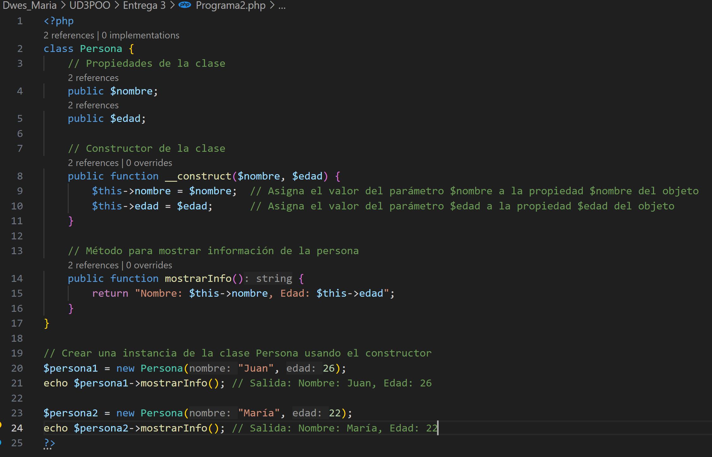
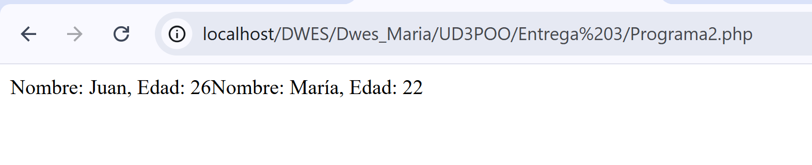
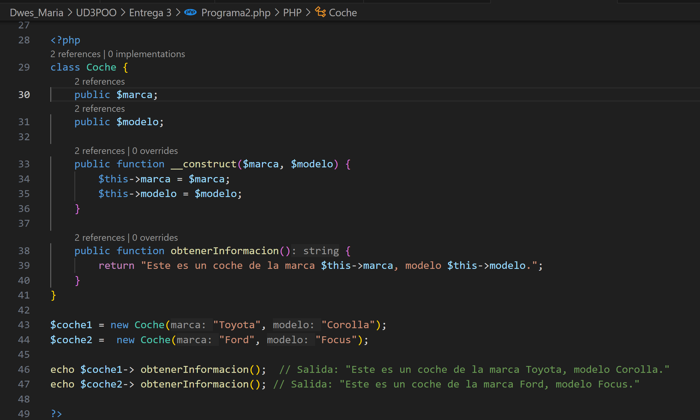
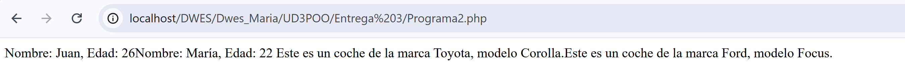
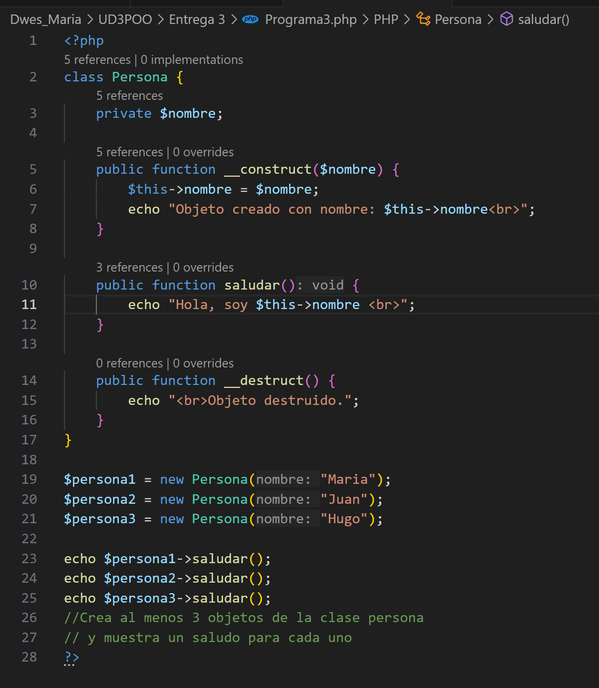
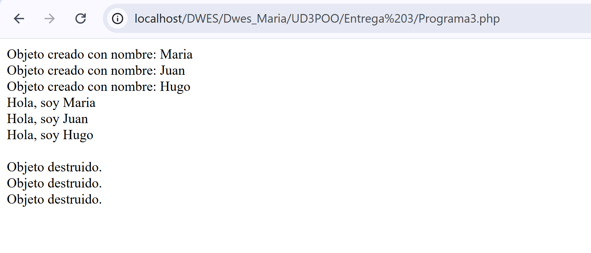
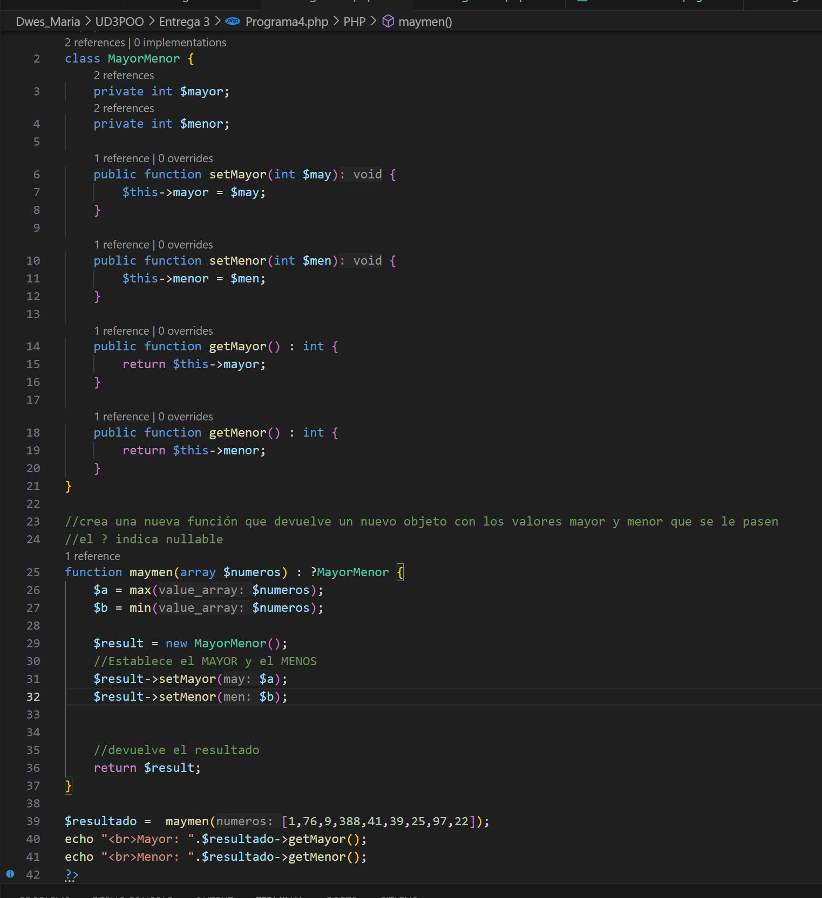
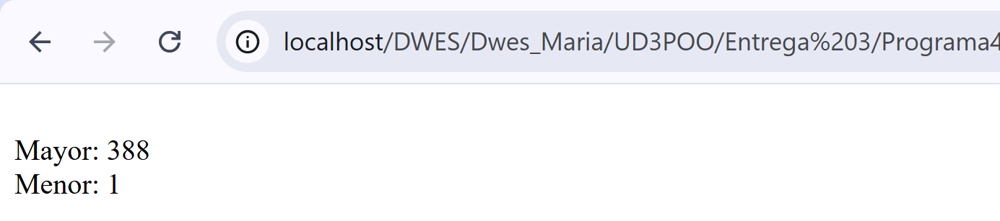
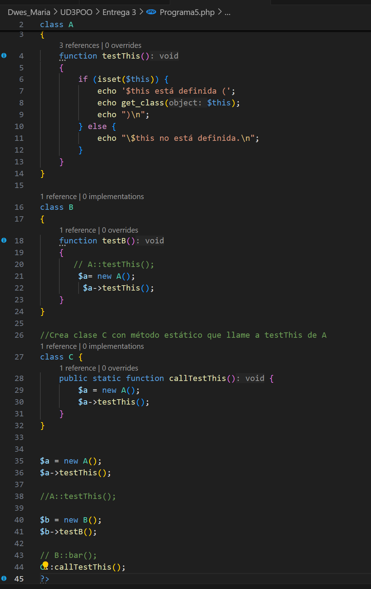
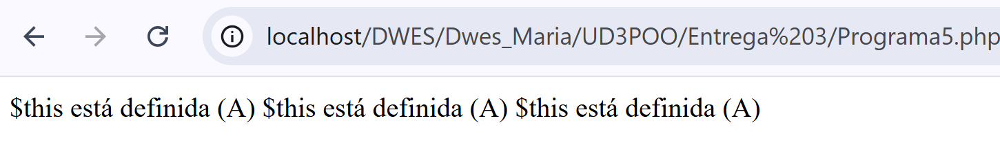

# Entrega 3: Programación Orientada a Objetos

> "Quienes aprovechan la IA de manera correcta podrán aprender más rápido y entregar mejores resultados".

Sinceramente estoy muy de acuerdo con esta frase ya que si entiendes de programación y si sabes pedirle a la IA algo específico, sabrás como usar la información que te genera

---

## Teoría

La **Programación Orientada a Objetos (POO)** nació en Noruega en 1967 con el lenguaje  Simula 67, creado por Kristen Nygaard y  Ole-Johan Dahl . Este lenguaje introdujo por primera vez los conceptos de  clases , subclases y  corrutinas , que dieron origen al paradigma orientado a objetos moderno.

Antes de la POO, la programación era  procedimental o imperativa , donde los datos y las instrucciones se trataban por separado. La POO unificó ambos aspectos al agrupar datos y comportamientos dentro de los  objetos , permitiendo una forma más natural y organizada de representar el mundo real en el código.

La base de este paradigma se sostiene en  **cuatro pilares fundamentales** :

Gracias a la POO en php se permite estructurar el código de forma modular, permitinedo hacerla reutilizable mediante clases y objetos. Mejorando asi la organización, escalabilidad y mantenimiento del software

Separar la lógica de negocio de la interfaz del usuario tiene varias ventajas:

* Facilita el mantenimiento, reutiliza código y la escalabilidad
* Permite realizar pruebas y depurar de manera independiente
* Mejora el trabajo entre frontend y backend
* Adapta la interfaz a diferentes plataformas
* Favorece el uso de patrones de diseño como Modelo Vista Controlador

---

## Programa 1: Creaciones de clases

Si fuesen privados, no podriamos acceder a ellos desde fuera de la clase 

---

## Programa 2: Constructor 

Al crear constructores podemos instanciar tantas clases como queramos con diferentes valores, en este caso vamos a crear varias personas y vamos a asignarle valores a través de su constructor 

El **destructor** (`__destruct`) se ejecuta automáticamente cuando el objeto se elimina o el script termina. Se utiliza principalmente para liberar recursos, cerrar conexiones o realizar limpieza de memoria.

Hemos completado ahora el código que vemos justo arriba para que se ejecute correctamente 

---

## Programa 3: Destructor 

He creado a 3 personas con el constructor, las saludo y se destruyen porque el script ha terminado. En programas donde es script no termina, el objeto no se destruye. Para destruirlo usar unset($persona1)

---

## Programa 4: Setter y getter

Para que este programa funciones, debemos setearle a la clase tanto el menor como el mayor y unas vez ya tiene los valores, puede cogerlos con un get para así mostrarlos 

---

## Programa 5: THIS 

En la clase C al ser una función estática podemos ver en linea 43 y 44 que no hace falta hacer una instancia de la clase para usarla
