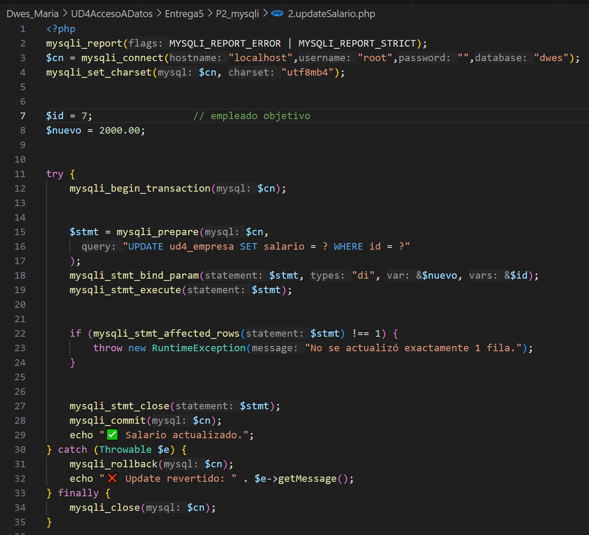
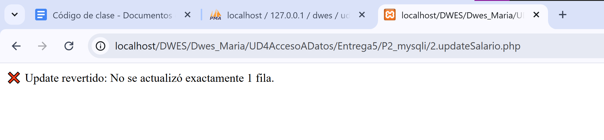

# Entrega 5: Acceso a datos

## Historia de php y sus versiones

En el siguiente enlace podemos conocer un poco sobre la historia de php junto con sus diferentes versiones, desde php 3 hasta la más reciente php 8:

https://www.php.net/manual/es/history.php.php

Como conclusión personal podemos saber que PHP pasó de ser una herramienta simple a un lenguaje clave del desarrollo web gracias a su evolución constante y apoyo comunitario. Su historia demuestra que la adaptación es esencial para perdurar en la tecnología.

## P2_mysqli

