p2 ejemplo 1

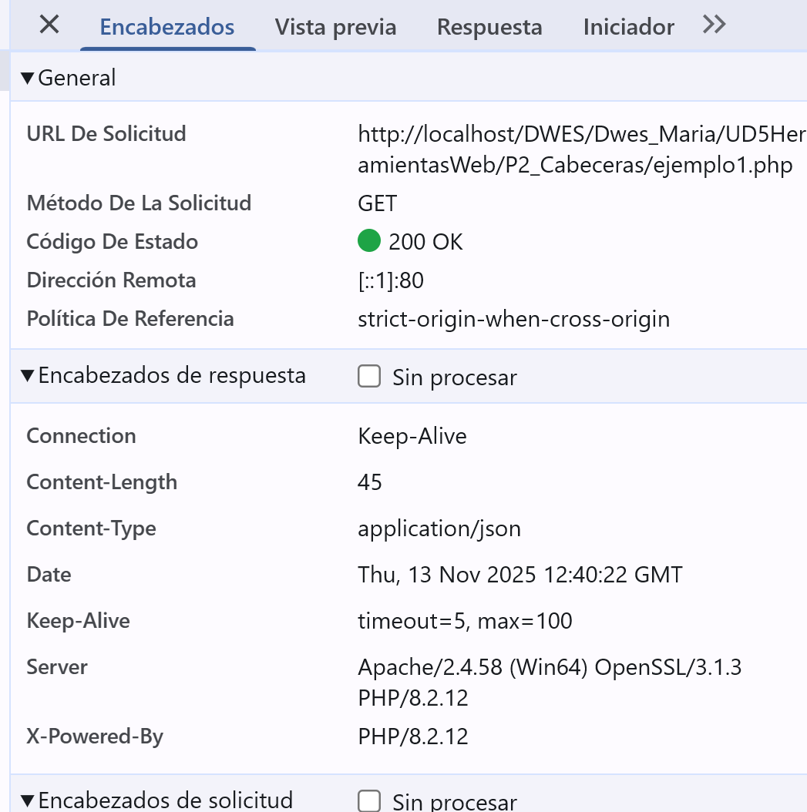

p2 ejemplo 2

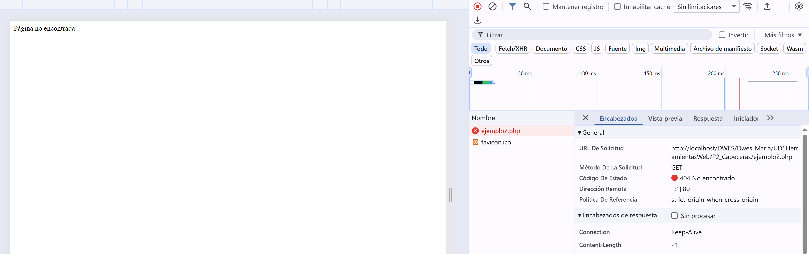

p2 ejemplo3

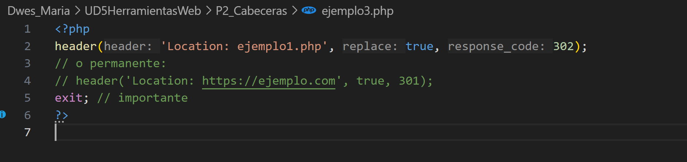

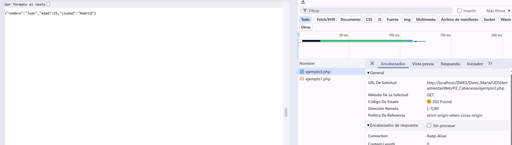

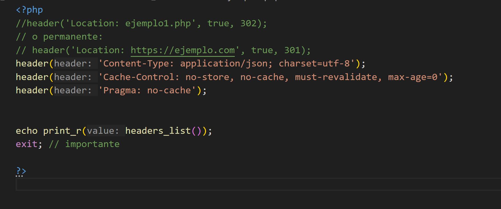

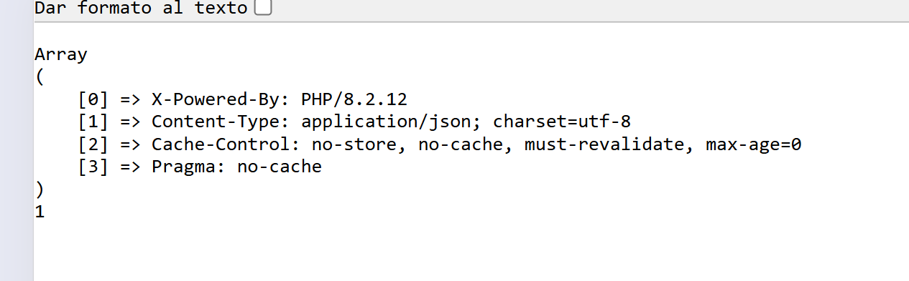

Ejemplo 4

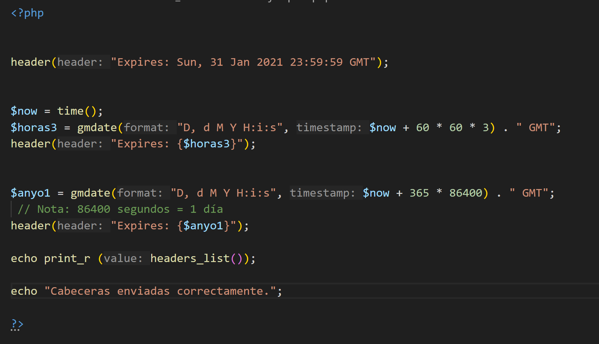

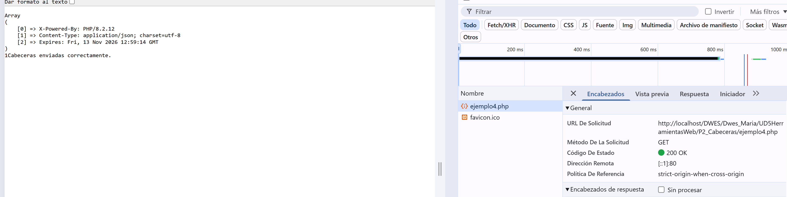

programa 3

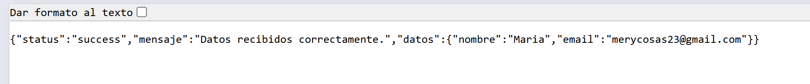

programa4

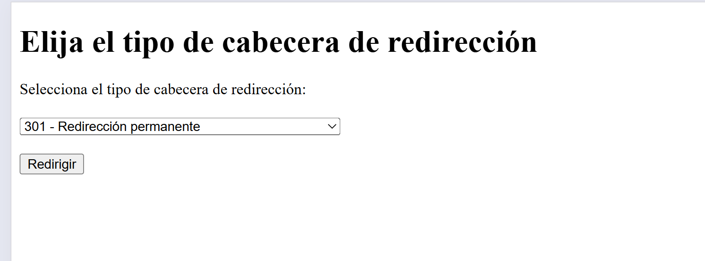

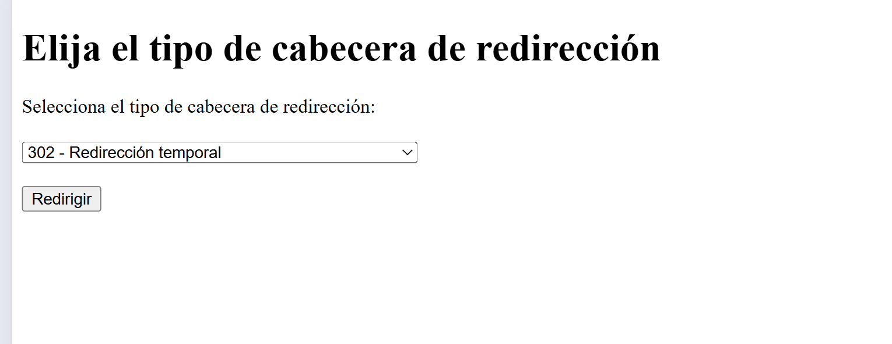

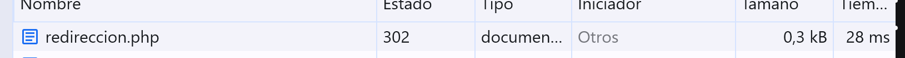

Punto 2 Estado Sesiones 

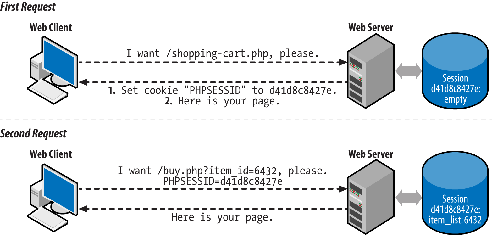

p5_ sesiones ejemplo 1

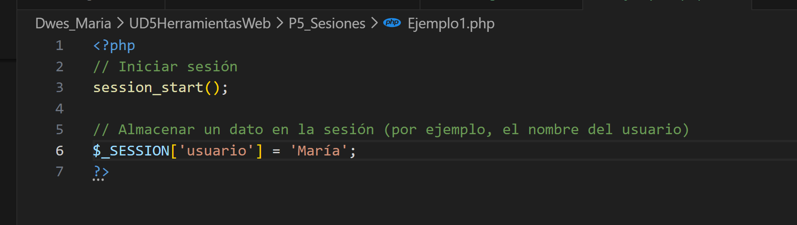

P5_ sesiones programa 5 

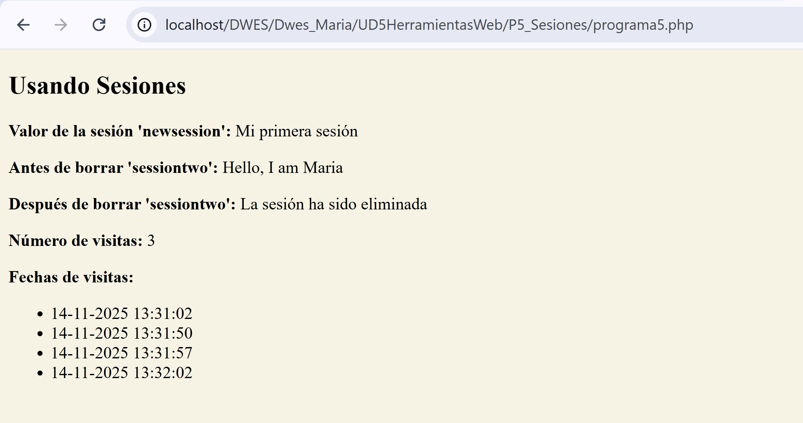

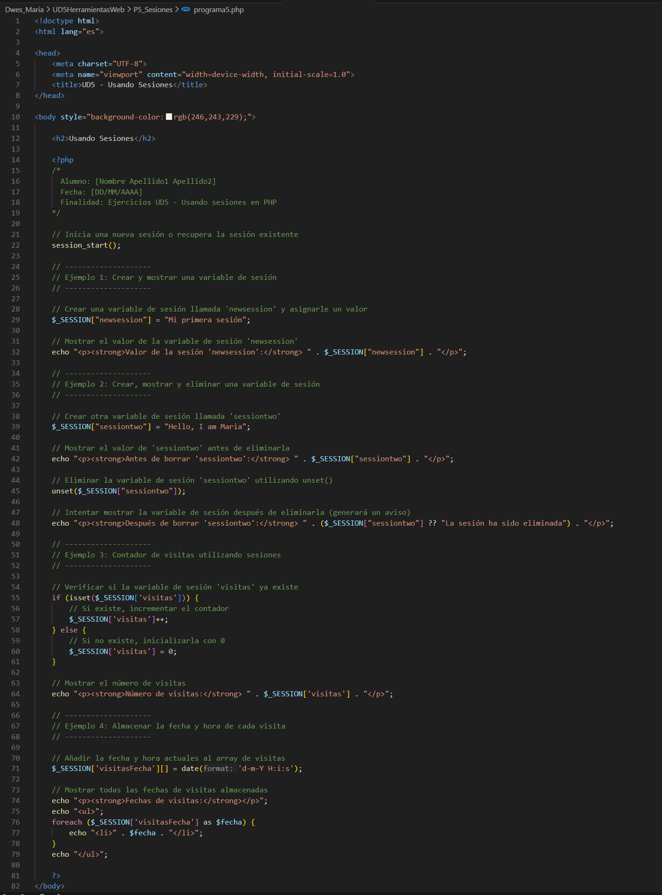

P6_cookie

ejemplo1 

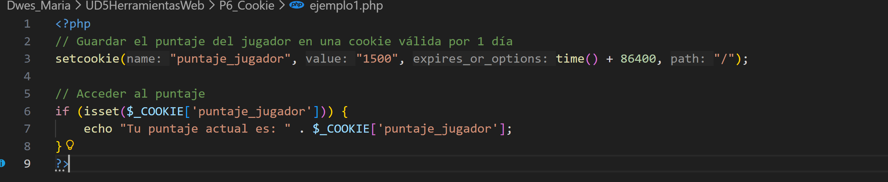

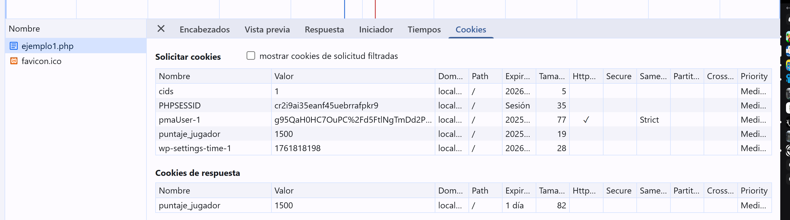

ampliado 

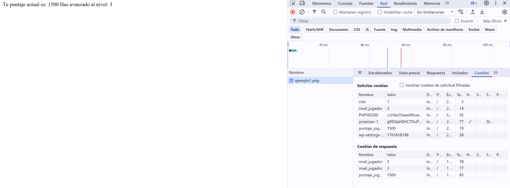

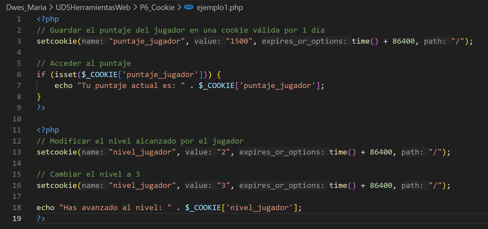

ejemplo3 

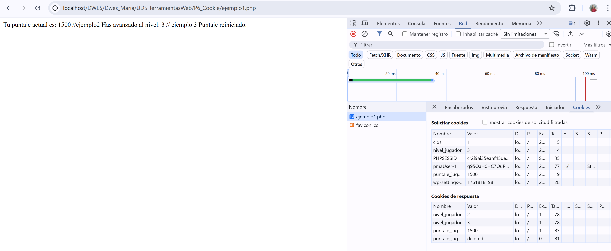

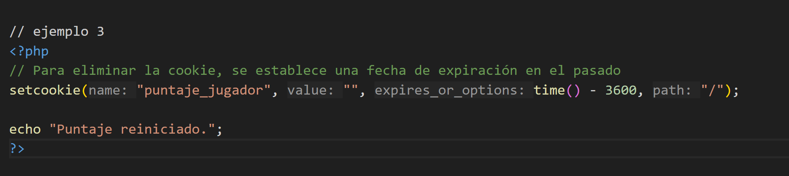

ejemplo4 

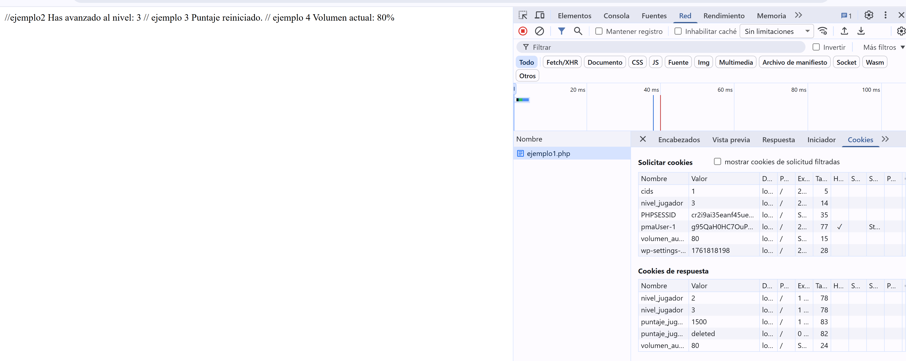

ejemplo6

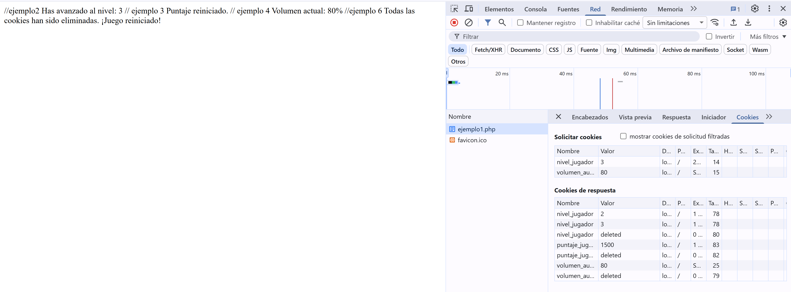

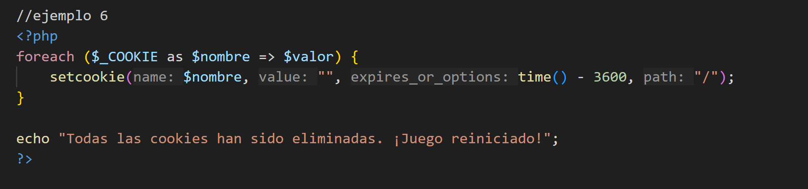

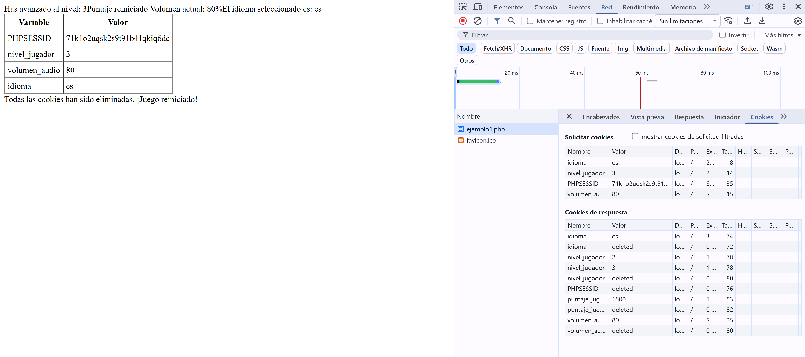
