# PedalPoint 

Para este proyecto se nos pidió realizar un CRUD con MVC y acceso a base de datos con SQLITE. A lo largo de este readme, voy a ir desglosando mi trabajo dia a día 

## Día 1: 19/11/2025

Este dia para mí es el que más me gusta especialmente, cogí papel y boli y me creé las clases necesarias con los atributos, para que a la hora de crear la base de datos lo tuviese todo más claro, tambien me apunte los primeros pasos para programar mi proyecto:

1º: Creamos la estructura del proyecto 

2º Creamos los archivos de configuración, y de base de datos con un usuario administrados por defecto ya en ella

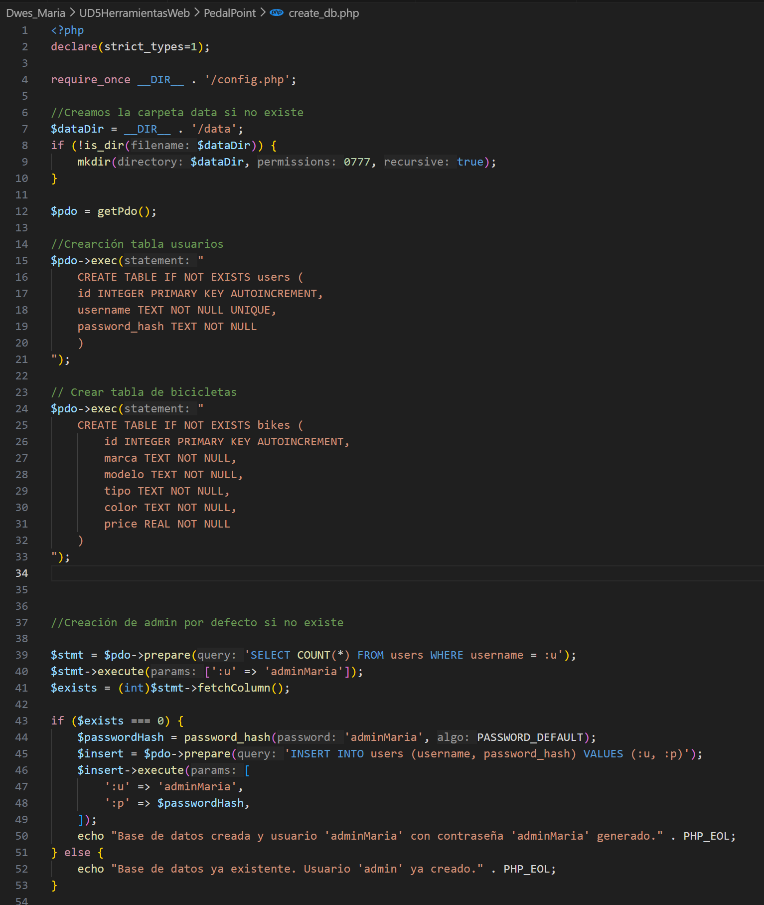

3º Ejecutamos el archivo para que se nos cree la base de datos 

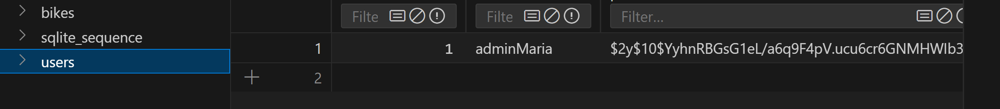

Una vez creado esto, ya podemos programar como sería la entrada a nuestra aplicación, Iniciar Sesión 

Tenemos ahora un modelo admin

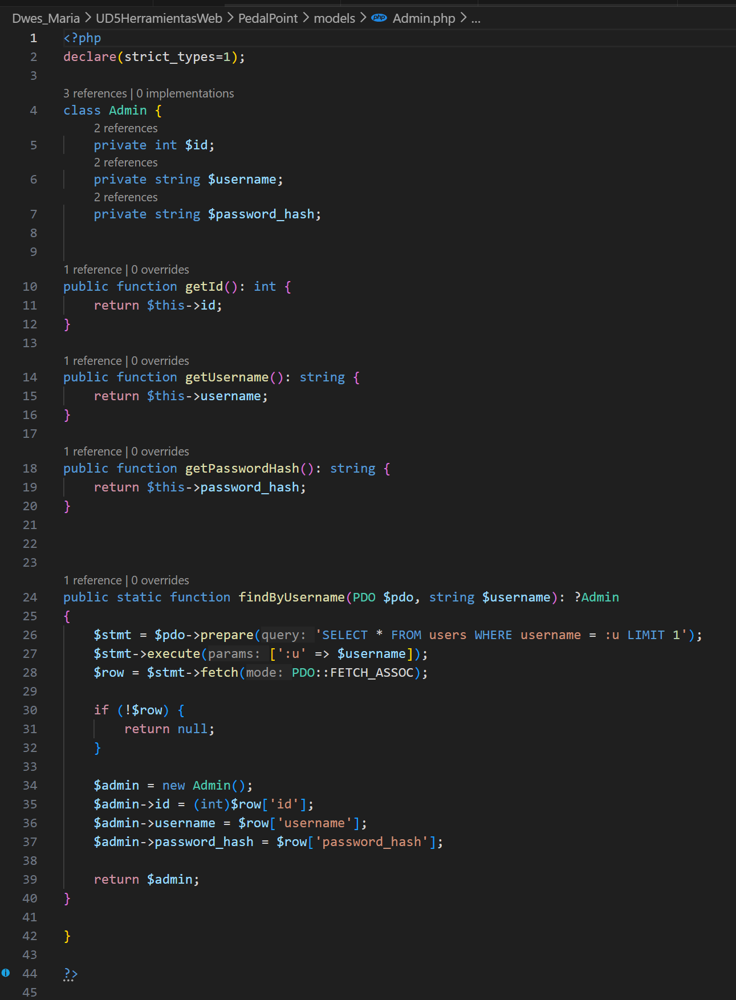

Con su correspondiente controller, con todas las funciones necesarias para el admin como loguearse o desloguearse

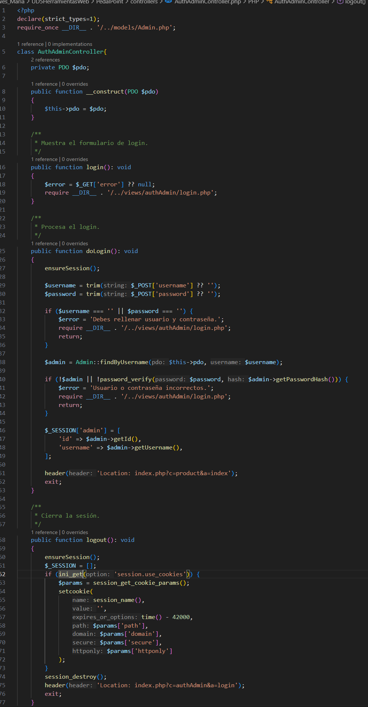

Tenemos tambien nuestro archivo index.php, este va a ser el punto de partida de nuestra web y además el enrutador que nos guiara a traveés de ella 

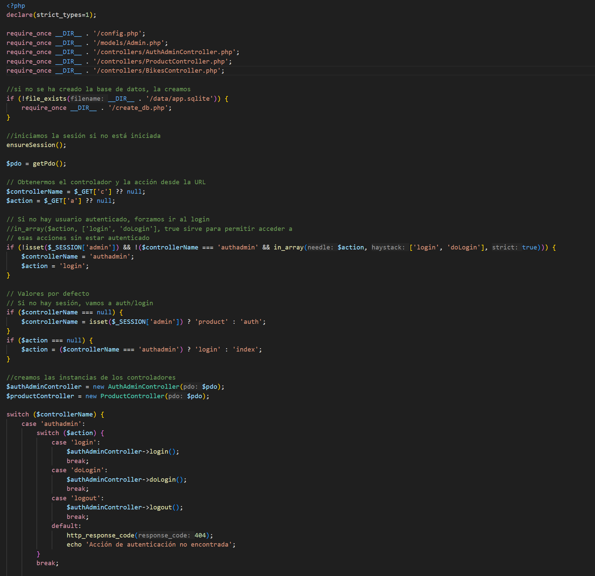

Resultado final:

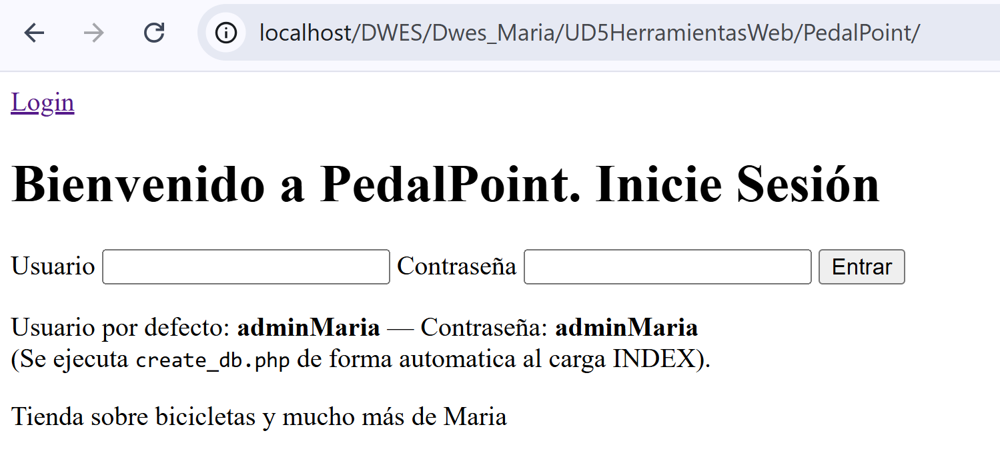

Como resultado final tenemos un incio de sesión completamente funcional 

## Dia 2: 20/11/2025

Para el dia de hoy mi objetivo era hacer el crud completo del objeto bicicleta 

Para ello me cree la base de datos de la bicicleta 

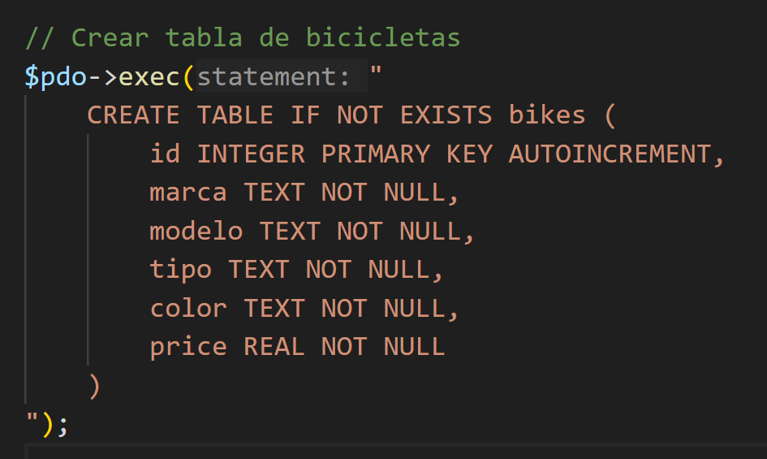

Despues me cree el modelo de bicicleta 

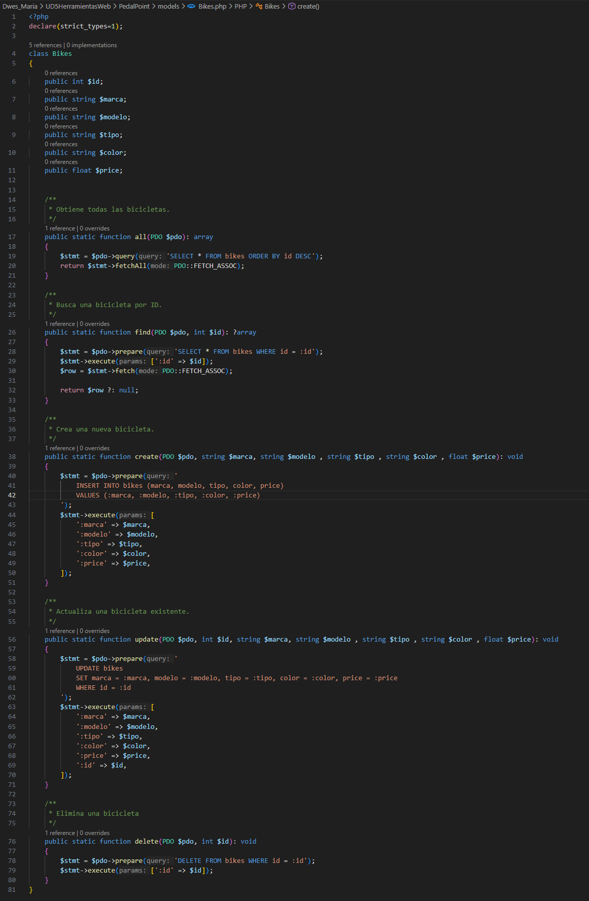

Despues me cree el controlador de bicicleta 

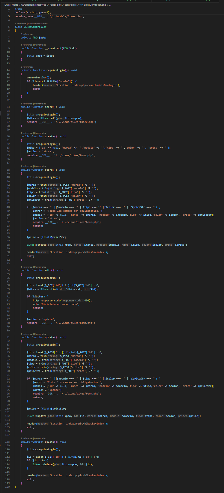

Las vistas de la bicicleta tanto el index como el formulario de creacion

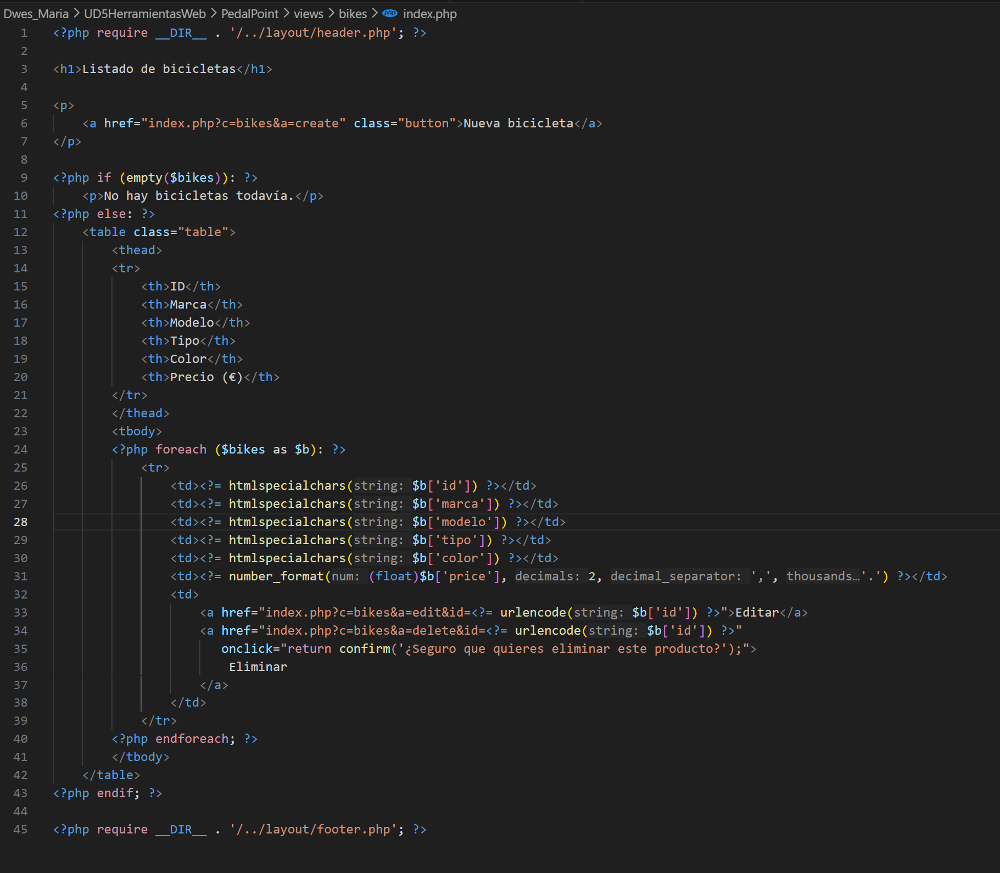

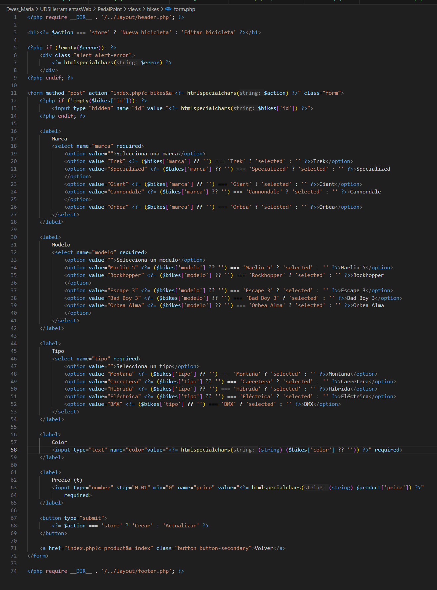

Y actualicé el index.php con el case producto que es la vista de bienvenida, a traves del header el admin podra elegir a donde quiere ir y bicicleta 

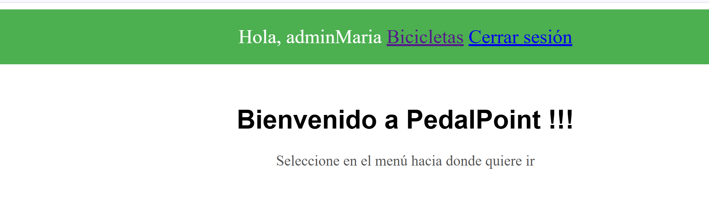

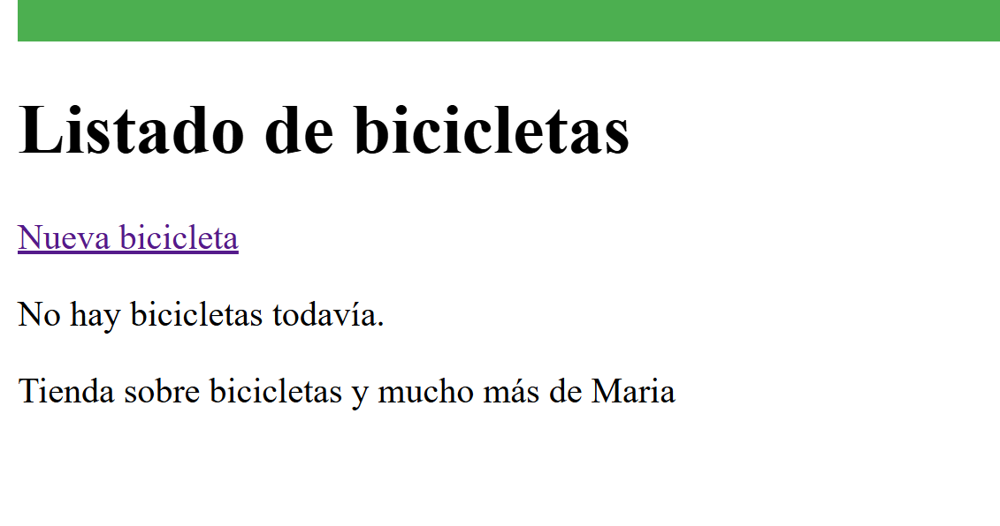

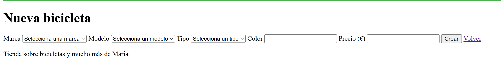

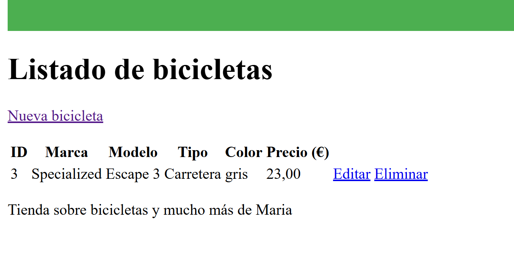
