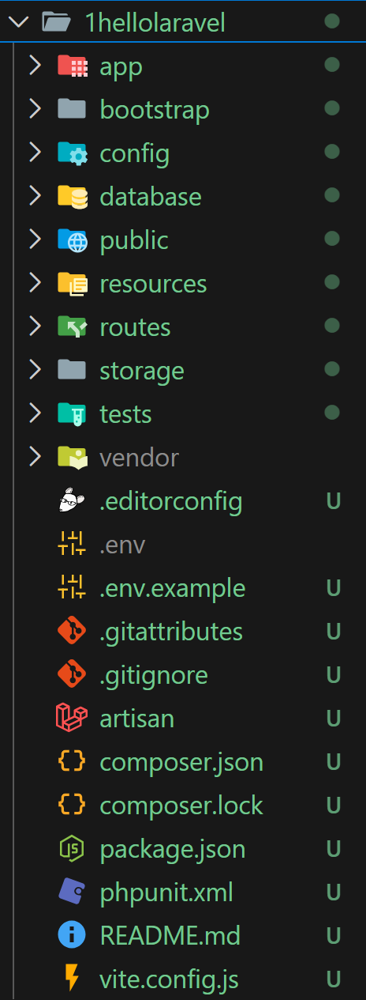
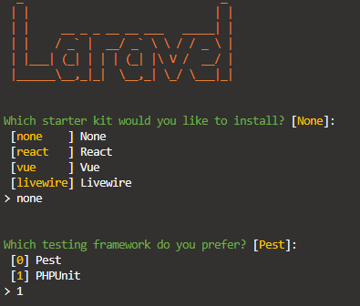
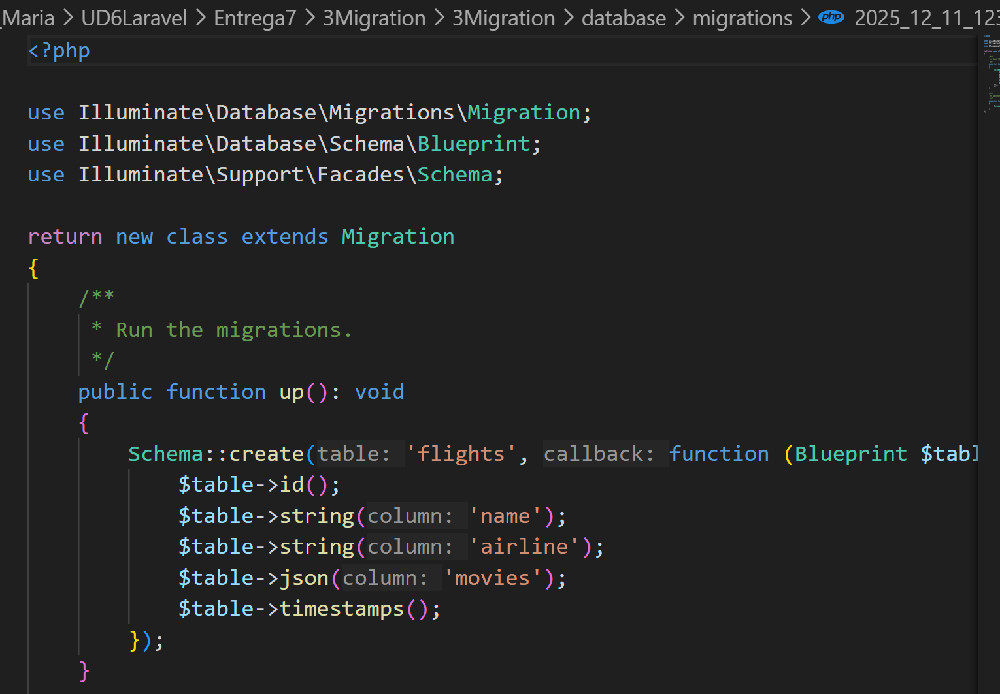
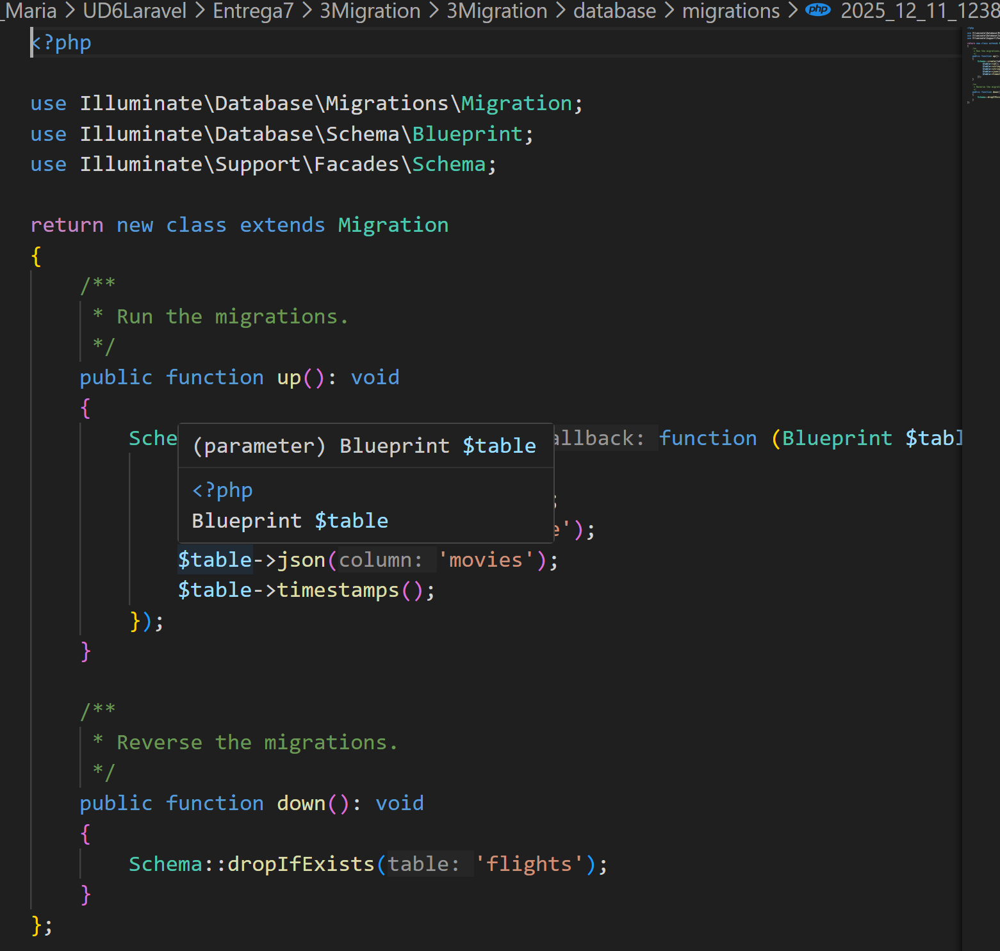

# Entrega 7: Laravel parte 1

## Proyecto 1: helloLaravel

Crearemos este primer proyecto para ver el patrón y la estructura de archivos. Tenemos que descargar Composer y a partir de ahí iremos aprendiendo sus comando

Crearemos nuestro proyecto con el comando :

**`composer create-project laravel/laravel 1helloLaravel`**

Esto comenzará a crear el proyecto con sus respectivas dependencias. Una vez ha finalizado ya tenemos nuestro proyecto creado

Para iniciar el proyecto:

`php artisan serve `

Si queremos modificar el puerto 

`php artisan serve --port=5000`

## Proyecto 2: helloLaravel

Ahora con el coamando laravel instalado, es más fácil, ahora solo tendremos que usar el comando

`laravel helloLaravel`

Con esta opción, nos ofrece diferentes opciones y starters kit

Una vez instalado, podemos entrar al proyecto y con el comando

`php artisan serve`

se ejecuta el proyecto y ya podemos verlo en la web

## Proyecto 3: Migraciones

Las migraciones son como un control de versiones para su base de datos. Laravel proporciona soporte independiente de la base de datos para crear y manipular tablas en todos los sistemas de bases de datos compatibles con Laravel.

Podemos usar el comando make:migration para generar una migración de base de datos

La nueva migración se colocará en el directorio database/migrations

Cada nombre de archivo de migración contiene una marca de tiempo que permite a Laravel determinar el orden de las migraciones

### Crear migraciones

Para crear una nueva migration usaremos el comando 

`php artisan make:migration create_fligths_table`

Laravel utilizará el nombre de la migración para intentar adivinar el nombre de la tabla y si la migración creará o no una nueva tabla:

Si Laravel puede determinar el nombre de la tabla a partir del nombre de la migración, Laravel completará previamente el archivo de migración generado con la tabla especificada, de lo contrario, puede simplemente especificar la tabla en el archivo de migración manualmente 

### Aplastar migraciones

A medida que avanzamos con la aplicación podemos acumular cada vez más migraciones, esto puede hacer que se sature el directorio es por eso que podemos comprimir las migraciones un un solo archcivo SQL con el comando:

`php artisan schema:dump `

`php artisan schema:dump --prune`

### Estructura migratoria

Una clase de migración contiene dos métodos: up y down

* El up método se utiliza para agregar nuevas tablas, columnas o índices a la base de datos
* El down método debe revertir las operaciones realizadas por el up método

### Ejecutar migraciones

Para ejecutar todas las migraciones pendientes debemos usar el comando:

`php artisan migrate`

Para ver las migraciones que se han ejecutado hasta ahora podemos utilizar:

`php artisan migrate:status`

Si queremos ver las declaraciones SQL que se ejecutarán durante las migraciones sin ejecutarlas realmente usamos: 

`php artisan migrate --pretend`

Para forzar la ejecución de los comando sin solicitud  usamos:

`php artisan migrate --force `

Para revertir la última migración, podemos usar rollback:

`php artisan migrate:rollback`

`php artisan migrate:rollback --step=5`

Este revertirá las últimas 5 migraciones

Para revertir un lote específico de migraciones :

`php artisan migrate:rollback --batch=3`

Para ver las declaraciones SQL que se ejecutarán durante las migraciones sin ejecutarlas realmente usaremos:

`php artisan migrate:rollback --pretend`

Para revertir todas las migraciones de la aplicación:

`php artisan migrate:reset `

Revertir y migrar en un solo comando

`php artisasn migrate:refresh`

`php artisan migrate:refresh --seed`

Para revertir y migrar un numero limitado

`php artisan migrate:refresh --step=5`

Eliminar todas las tablas y migrar 

`php artisan migrate:fresh`

`php artisan migrate:fresh --seed0`
