# Clothing Store

Para este proyecto vamos a crear una nueva versión de Clothing Store que incluye un nuevo CRUD para los usuarios

## Paso 1: crear las rutas 

Nuestro programa ahora irá a una página principal donde podamos elegir hacia donde queremos ir

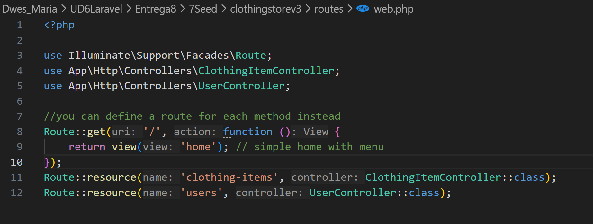

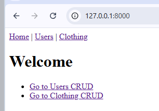

## Paso 2: UserController 

Creamos ahora el CRUD del usuario, para ello usaremos el siguiente comando 

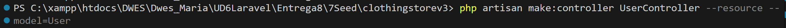

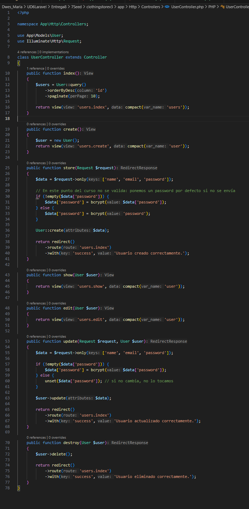

## Paso 3: Creamos las views del usuario y de la pantalla inicial 

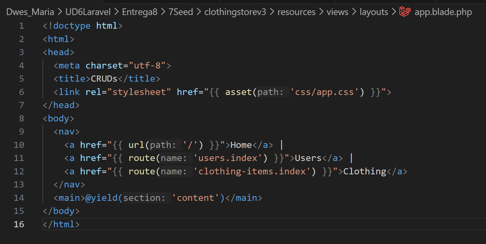

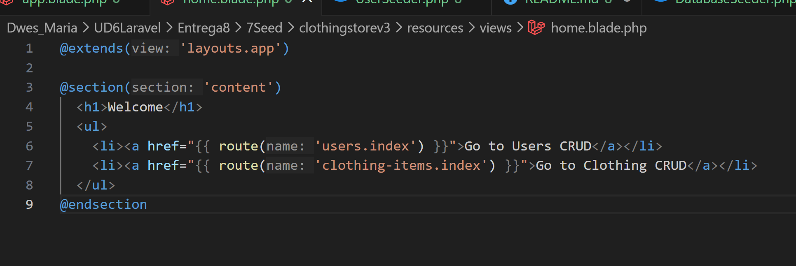

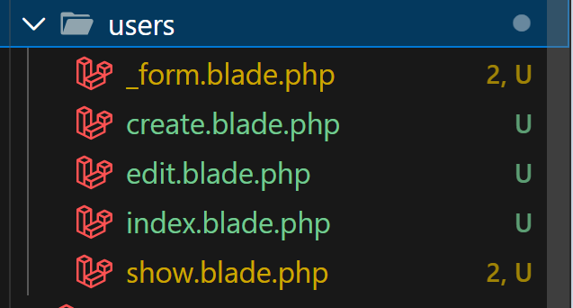

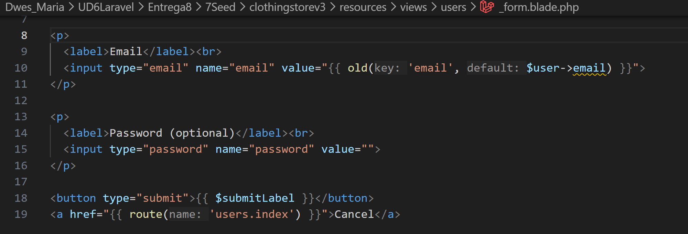

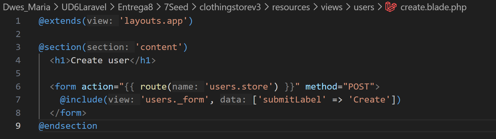

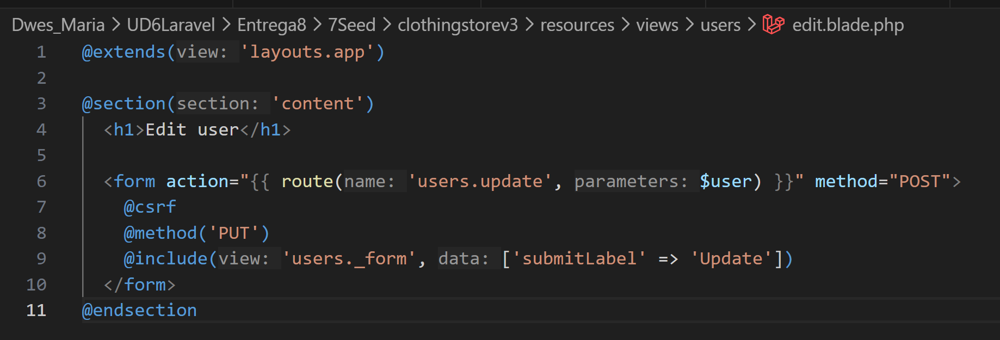

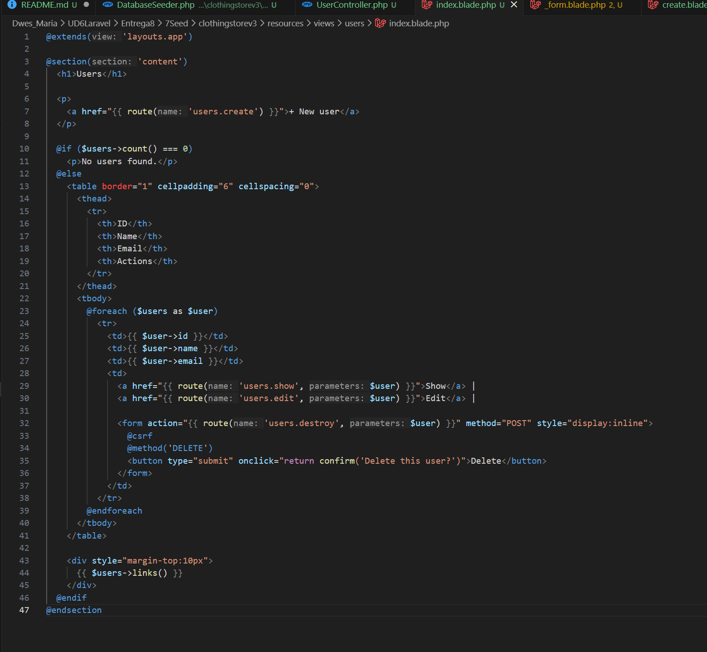

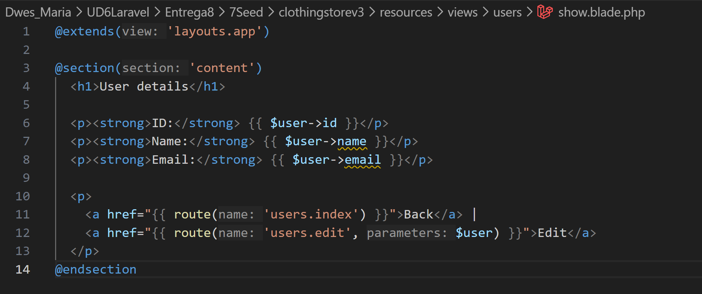

Todo lo demás se queda como estaba

## Paso 4: Migramos y podemos ejecutarlo 

`php artisan migrate`

`php artisan migrate:fresh --seed`

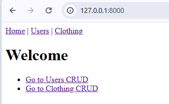

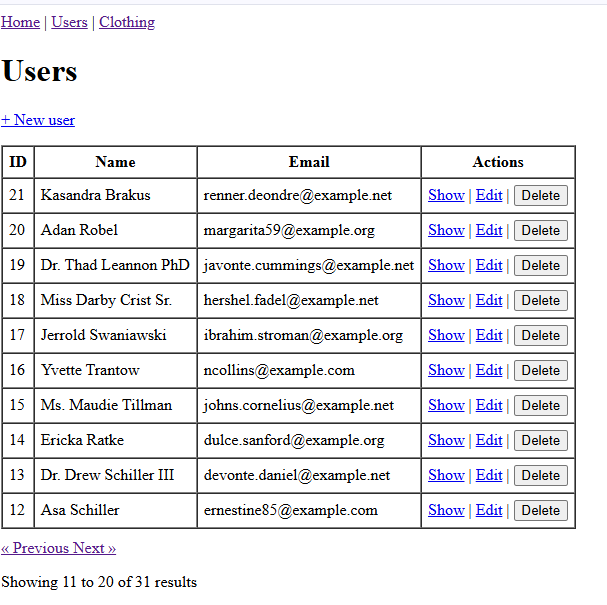

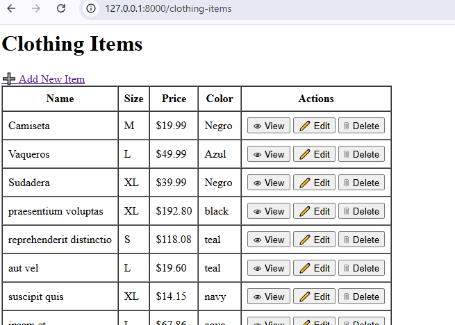
