# Proyecto cliente-pedido

Para esta parte de Laravel crearemos un proyecto donde gestionaremos clientes con sus respectivos pedidos como si fuesemos una tienda online de x producto. Para ello utilizaremos todo lo visto en clase que son: Blade, Migration, Model, Controller, CRUD, SeederFactory y las relaciones.

## 1º Creamos el proyecto

Primero vamos a crear nuestro proyecto en Laravel con el comando composer create-proyect laravel/laravel clientes-pedidos. Esto nos creará un proyecto básico con todo lo ensencial para que funcione.

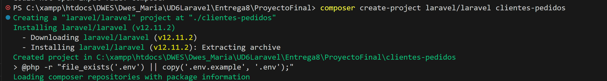

## 2º Creamos modelo, migración y controller de Cliente

Lo siguiente que haremos es crear el modelo, migración y controlador del cliente, elegimos el cliente ya que sería como el "padre" con respecto a los pedidos. Para ello usaremos el comando php artisan make:model Client -mc, este comando nos crea del tirón todo lo anterior

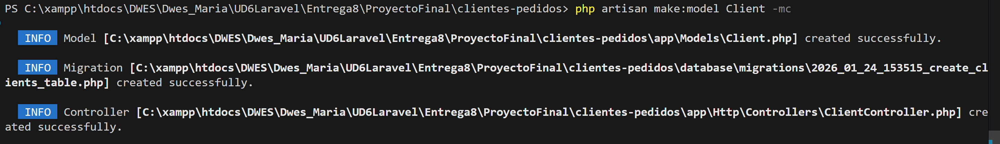

## 3º Actualizamos el contenido de la migracion y la ejecutamos

Dentro del archivo de la migración del cliente vamos a modificar los campos que queremos que tenga la tabla de los clientes, como curiosidad, el modelo se creará como Client mientras que la tabla irá en minúscula y en plural (clients). Nuestro cliente tendrá un id con el que se identificará, un email único, un teléfono que puede ser nulo, la dirección que puede ser nula también y un boleano activo que por defecto será true, es decir activo, además òr supuesto se guardará la hora. Por último ejecutamos la migración con el comando php artisan migrate para crear la tabla en la base de datos

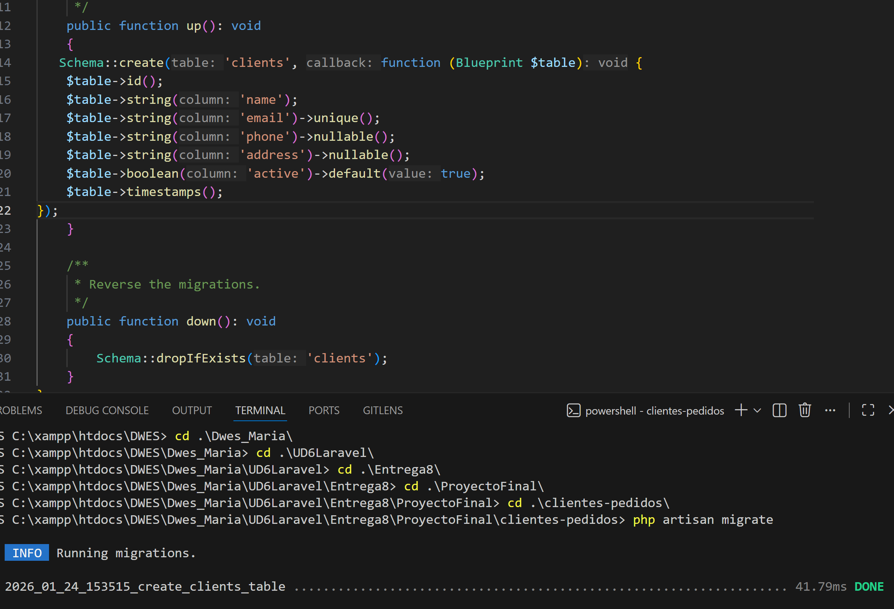

## 4º Creamos el modelo con sus relaciones

Pasamos ahora a crear el modelo, esto nos servirá como bien dice su nombre de modelo para los objetos que vayan a guardarse en la base de datos, todos sus atributos serán protected y fillable lo que quiere decir que podrán ser modificados en la base de datos, el id no se podrá modificar por lo que sería guarded, pero laravel ya lo intuye ya que no está dentro del fillable. También tenemos aquí la relación, en este caso será hasMany con los pedidos. Como punto clave destacar el uso del use HasFactory, lo cual es esencial para que la factoria sepa como tiene que crear los objetos

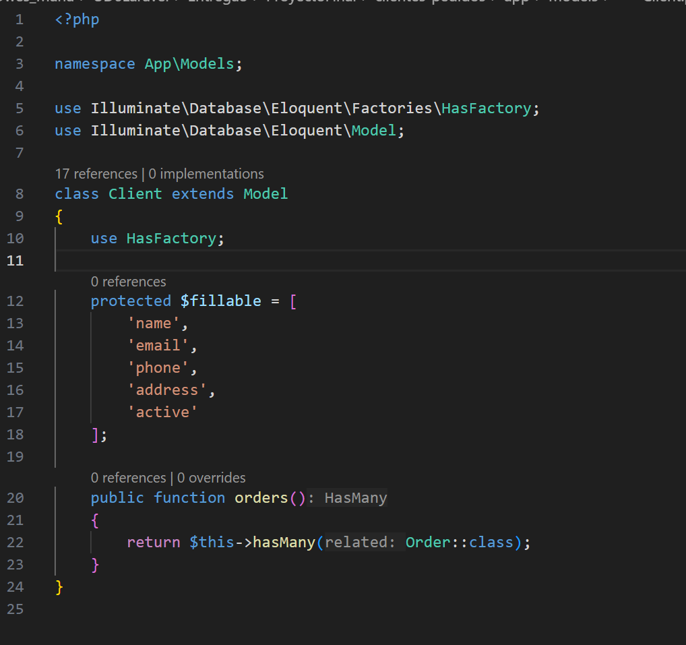

## 5º Hacemos los mismo con los pedidos

Usando el mismo comando que en el cliente vamos a hacer los pedidos para crear así su modelo su migración y su controlador

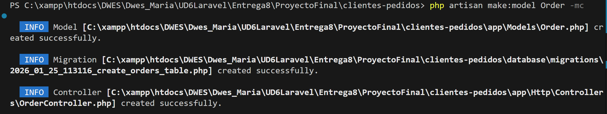

## 6º Creamos la migración

Actualizamos el archivo de migración de los pedidos, como punto más importante aquí destacar el uso del enum, y el atributo client_id, que es el id que pasa de la tabla cliente, es decir de la 1 a la N. Tambien decir que tiene un on delete cascade, en caso de que el id del cliente se borre, todos los pedidos asociados a este id serán eliminados

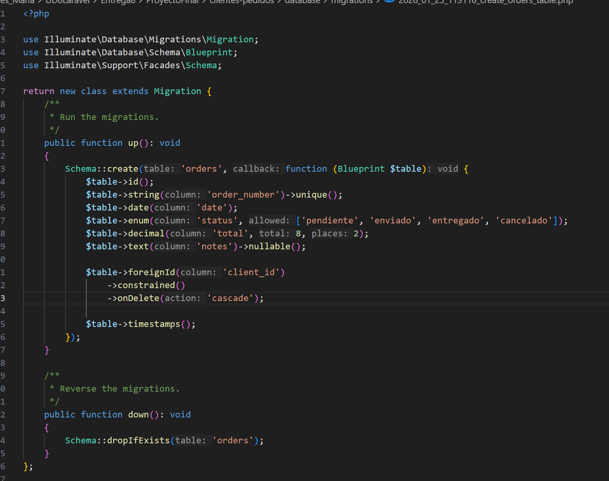

## 7º Ejecutamos la migración

Ejecutamos la migración para crear la tabla de pedidos

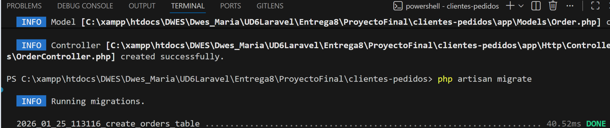

## 8º Completamos el modelo y hacemos la relación

Vamos ahora a rellenar el modelo al igual que el cliente, el pedido hace uso del HasFactory, del fillable y en este caso la relación es belongsTo

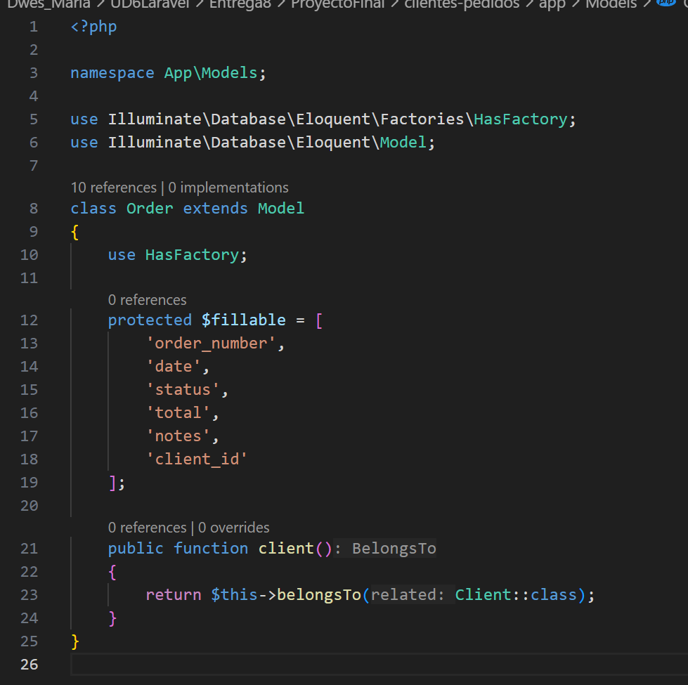

## 9º Actualizamos las rutas

Una vez tenemos ya los modelos y las migraciones necesarias vamos a crear las rutas a través de las cuales navergaremos entre los diferentes CRUD, tenemos el welcome tipico de laravel, el clients y el orders

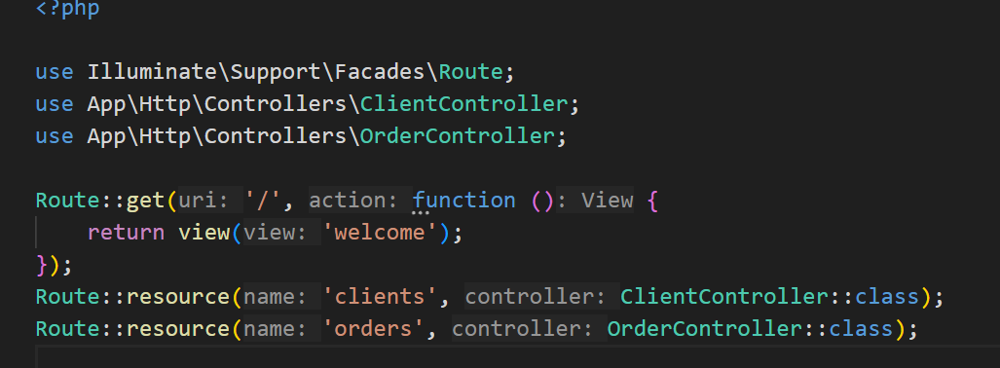

## 10 º Creamos clientController

Vamos a pasar ahora con la creación del controller del cliente que contará con con las funciones de index, create, store, show,edit, update y destroy

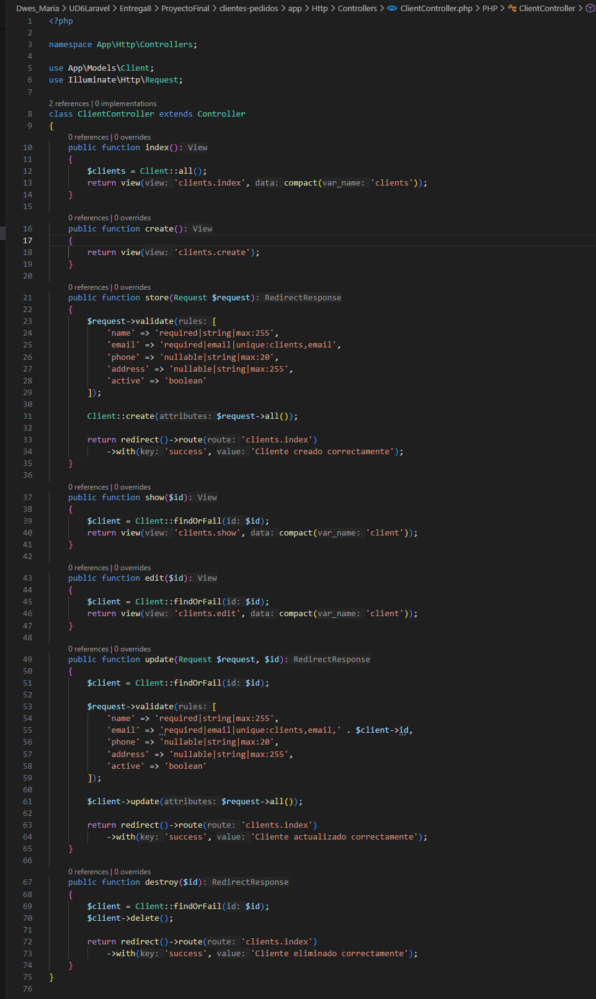

## 11º Creamos orderController

Al igual que acabamos de hacer en ClienteController hacemos en order controller con todas las funciones típicas del CRUD

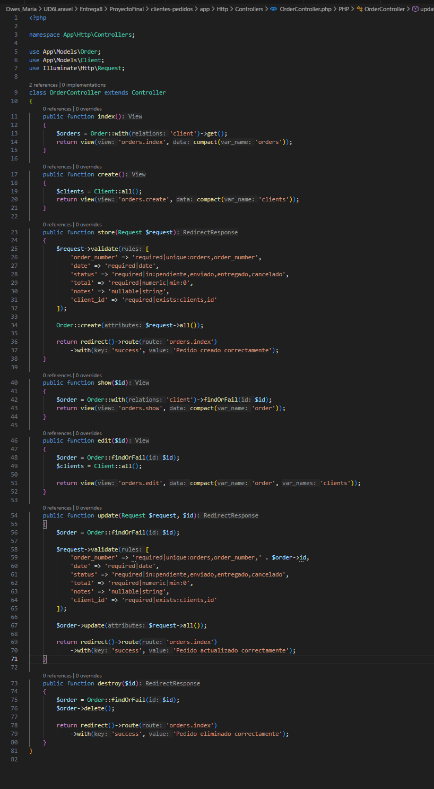

## 12º Creamos todas las vistas

A continuación una vez creados los controllers deberemos de crear las vistas por las que el usuario irá navegando, habrá una vista principal app.blade y luego tanto clients como orders tendrán las vistas de create, edit, form, index, y show

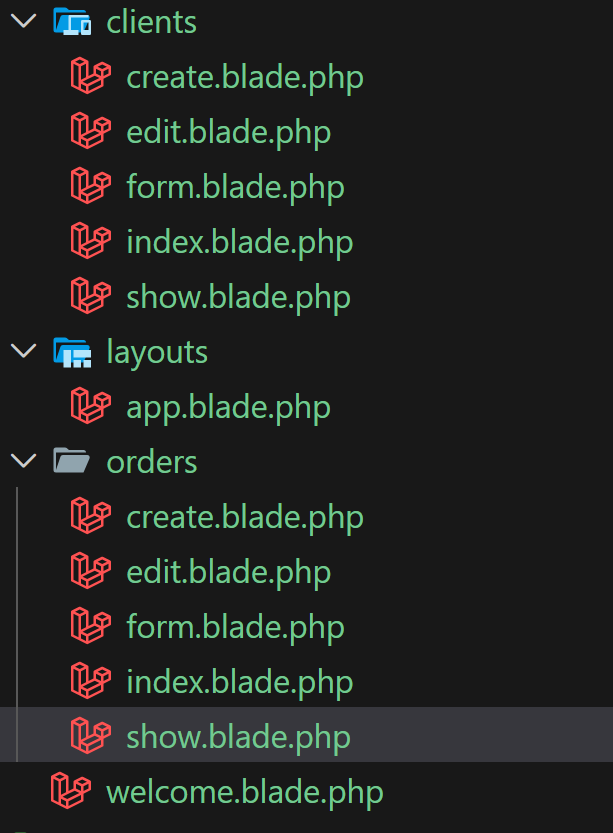

## 13º Creamos las factorias de cliente

Pasamos ahora a crear las factorias. Las factorias se usan para poder probar los programas con datos falsos pero en grandes cantidades por ejemplo, en este caso, vamos a crear a 10 clientes donde cada uno de ellos tendrá por defecto 3 pedidos

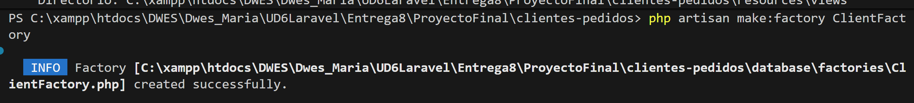

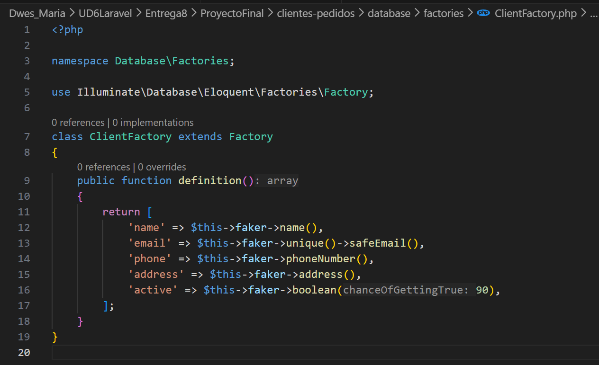

## 12º Creamos factorias de order

Usamos el random para que la factoria elija aleatoriamente el valor que ella decida entre las opciones que les damos

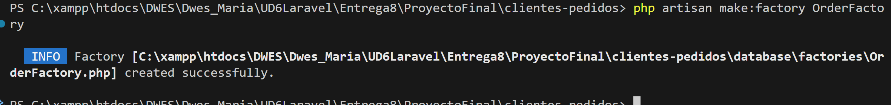

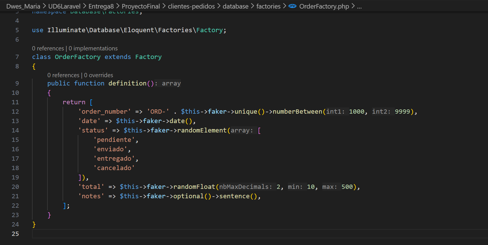

## 13º Creamos las seeders de cliente y de order

Pasamos ahora a crear las seeders que son como los datos a fuego que va a llevar nuestra tabla en la base de datos tanto clientes como pedidos en este caso uno de cada

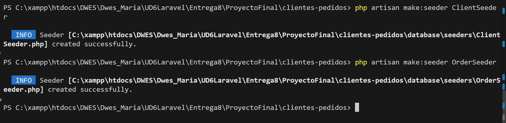

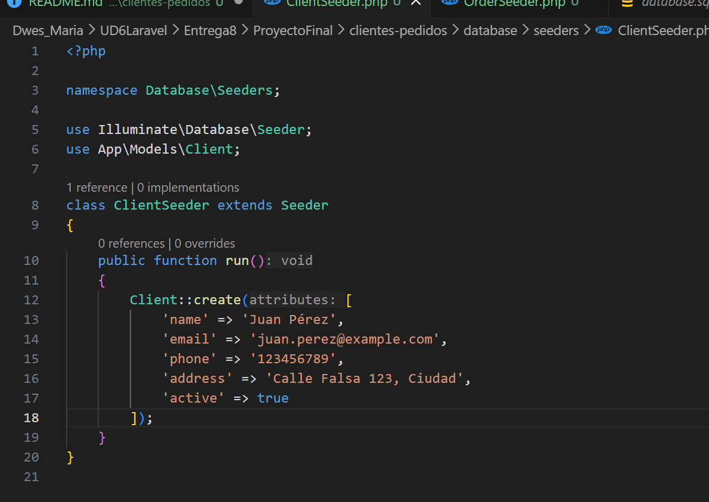

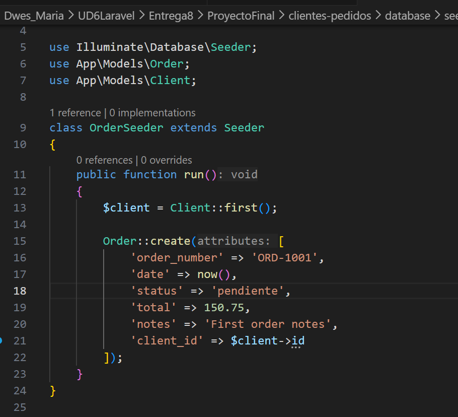

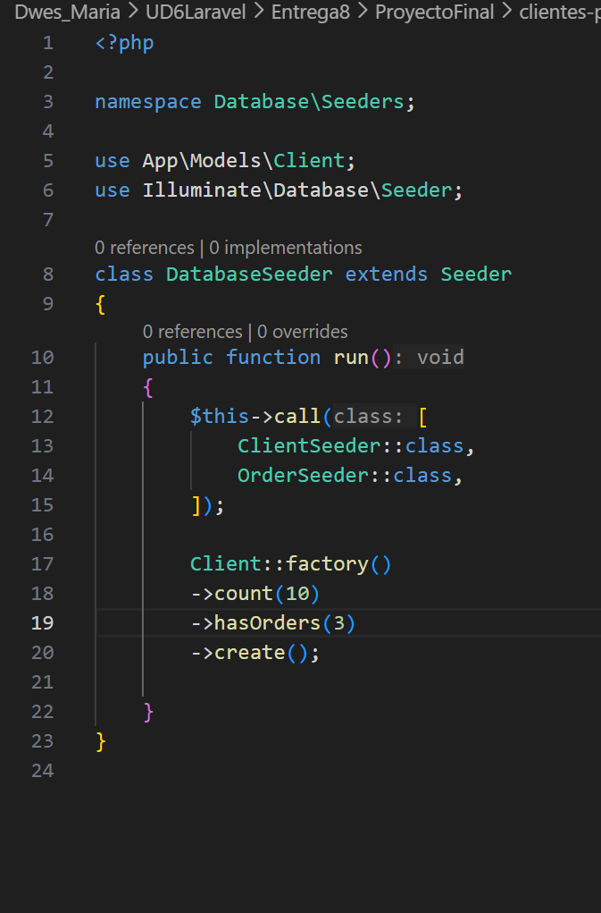

## Enlace video explicativo 

https://drive.google.com/file/d/1HEN01BMRmBejICVk1XR4UZ7qIIAZG4Ec/view?usp=sharing
