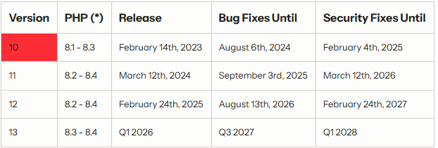

# Laravel 

En esta unidad vamos a aprender a como hacer proyectos de Laravel. 

Laravel es un framework de aplicaciones web con una sintaxis expresiva y elegante. Un framework web proporciona una estructura y un punto de partida para crear la aplicación. 

Nos da funciones portentes como inyección de dependencia, una capa de abstracción de base de datos expresiva, colas y trabajos programados y pruebas unitarias y de integración 

Estas han sido las últimas actualizaciones de Laravel 

Laravel permite diferentes tipos de patrones de arquitectura, aunque MVC es el por defecto 

Esta unidad 6 la voy a devidir en 2 entregas diferentes Entrega7 que engloba todo lo visto antes de las vacaciones de navidad y Entrega 8 que incluye todo lo visto desde la vuelta de las vacaciones de navidad
